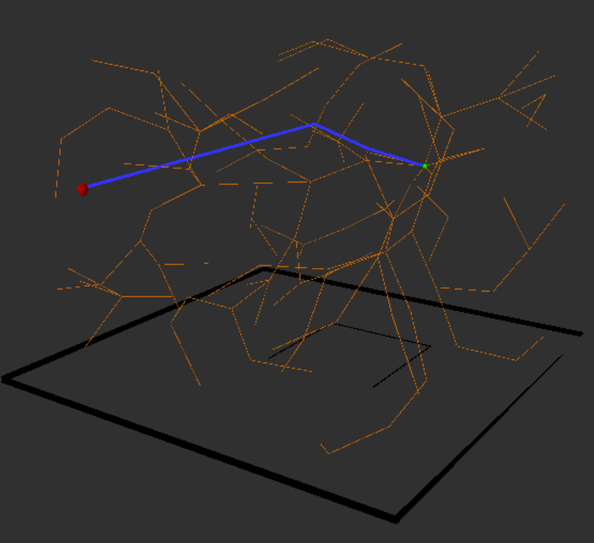

## Description
A 3D collision-free path planning algorithm based on RRT and SP-RRT specialized for 8-link hyper-redundant robot implemented using ROS.

**Distro:**
  Ros neotic  

The algorithm find an 3D optimized path for a one obstacle environment. The visualtization is done in **RVIZ** and the code is written in **C++**.   

The package has **three** executables:  
1. rrt_node  
2. sp_rrt node  
3. env_node   

## RVIZ parameters:   
1. Frame_id = "/path_planner"   
2. marker_topic = "path_planner_rrt"   

## Instructions:   

1. Open terminal and type   
  $roscore   
2. Open new terminal and go to the the root of your catkin workspace   
  $catkin_make   
  $source ./devel/setup.bash   
  $rosrun path_planning env_node   
3. open new terminal   
  $rosrun rviz rviz   
4. In the RVIZ window, change:   
  fixed frame under global option to "/path_planner"   
  add a marker and change marker topic to "path_planner_rrt"   
5. Open new terminal   
  To run RRT algorithm:
  $rosrun path_planning rrt_node    
  To run SP_RRT algorithm:
  $rosrun path_planning sp_rrt_node  

## Reference: 
**Code:** based on a planar RRT implementation from https://github.com/nalin1096/path_planning.  
**SP-RRT:** H. Wei, Y. Zheng and G. Gu, "RRT-Based Path Planning for Follow-the-Leader Motion of Hyper-Redundant Manipulators," 2021 IEEE/RSJ International Conference on Intelligent Robots and Systems (IROS), 2021, pp. 3198-3204. 

## Visualization
  
